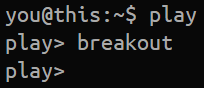
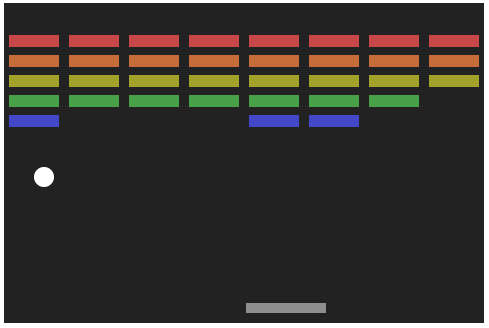
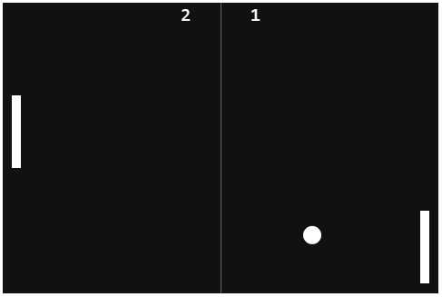

# HTML5-JS Games
Very simple JavaScript game realized inside an HTML5 Canvas. 

Just code kata, this is not meant to be a serious project, but something I do for fun.

## Demo
Type ```play``` and then the name of the game on [GaetanoBonofiglio.com](http://www.gaetanobonofiglio.com/).

Example:



## Breakout


## Snake


## Pong

